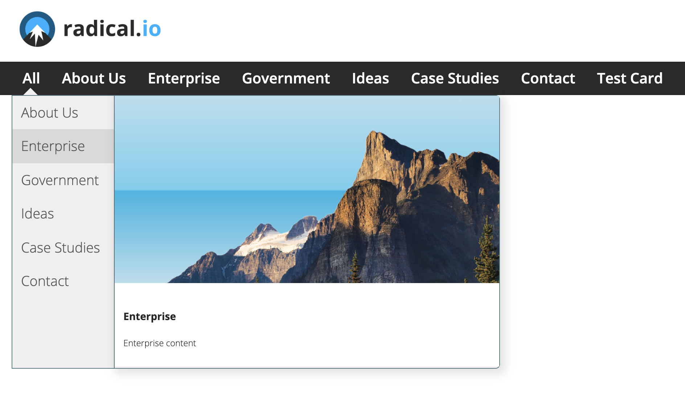
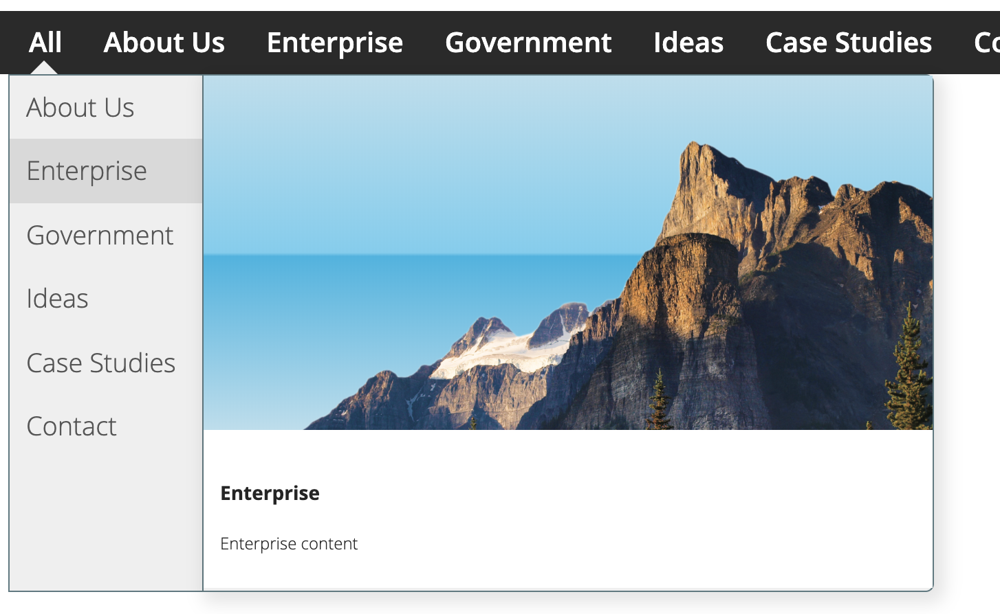
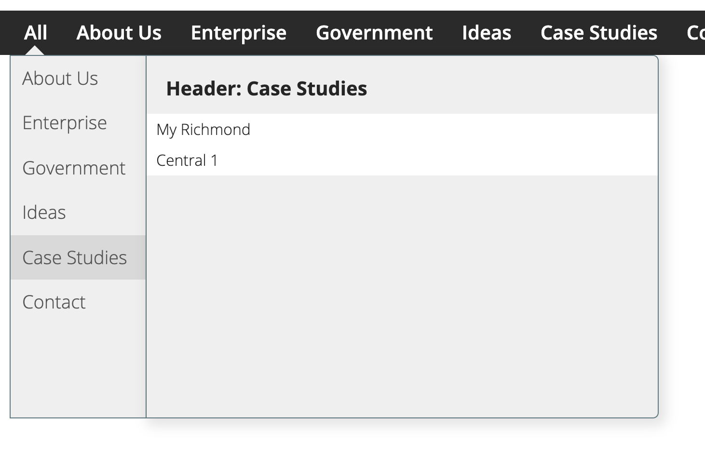
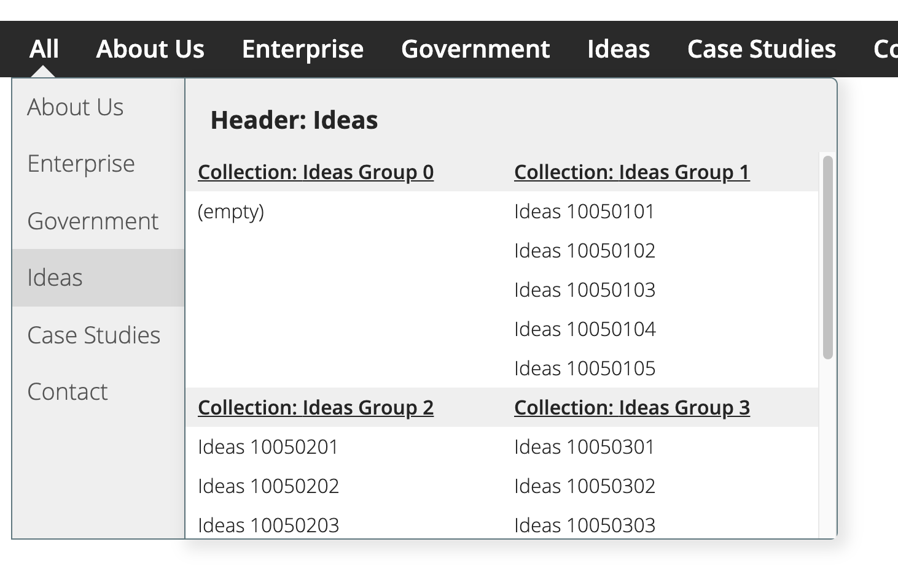

# react-dropmenu 

[React DropMenu](https://www.github.com/radicalio/react-dropmenu)

 

The React DropMenu is a component that can take JSON data and show drop-down style
vertical menus. There module is made off of a few distinct components. It is data driven,
and needs to be supplied with JSON (or javascript object) data. The data is tree like 
structure of page objects where each leayer in the tree is an array of `page` objects.
each page can contain children in the page.items property which should also contain an
array of page objects.

This is partially based on work done in the react-mega-menu project by Baruch Hen, which 
emulates earlier 'menu-aim' style menus in other frameworks. His goal was to produce a 
more natural feeling navigation menu component that can distinguish between vertical 
menu traversal and a horizontal attempt to navigate to the submenu's content.

This module tries to make it a bit easier to use in your own project. You supply your own
data, and alter the CSS stylesheets. It comes with usable defaults for the style.

 
[![NPM Version][npm-image]][npm-url]
[![Downloads Stats][npm-downloads]][npm-url]


Major Components are:

- *NavBar*: a horizontal navigation bar, as might be used in a website header. Using 
an array of `page` objects as data, it shows a horizontal set of navigation links 
(using MenuAnchor). 
Each will activate when a mouse hovers over them to show a menu below (DropMenu) 
using the `page.items` array of child pages in the page data.
- *MenuAnchor*: A component that wraps its content with a link and wires in a 
drop menu to launch from it. a single item 
- *DropMenu*: Using an array of page objects, it shows a vertical menu of titles. 
Moving the mouse down over each item may also then show a `MenuContent` panel beside 
the drop menu. THe framework tries to keep the panel on screen and may choose to show 
the panel on the right or left of the vertical drop menu.
- *MenuContent*: Shows a panel for the Drop Menu item you are hovering over. There 
are multiple panel types that it might show, based on the data. 

Panel Types:

- Card: A visual card for an item without children 
- List: A list style presentation, showing this item as a header and a list of 
its children. 
- ListList: A List of lists presenation, showing this item as a header. It then shows 
sections for each of its children, where a section is a subheader and a further list 
of pages. This becomes a dense navigation style. 

#### Card
 

#### List


#### ListList



## Installation

```sh
npm install react-dropmenu --save
```

## Background

The menu is responsive, going up and down as expected, but when you attempt 
to point to the content container, it recognizes it and allows for a smooth 
transition without switching sections accidentally:

The menu can also present the content to the left instead of to the right:

## Usage

You can use the code to create an individual dropmenu from a memu anchor, 
or a NavBar of anchors and menus. 

When using the NavBar it uses an array of page objects to render a horizontal 
array of MenuAnchor links. These are created as anchor "a" tags but can also be 
styled as buttons. using the useButtons boolean. 

### Data
You will need to load data. I expect that you will do this as JSON data from an API, 
but the demo shows loading data as a javascript object statically. If using the static 
data approach, the data must be an exported as an object called `MenuData` containg an 
array of page objects. 

```sh
import { MenuData } from "./MOCK_DATA.js"
```
If using an API you can retrieve the array of data as JSON. You need an array of objects in JSON.
 

Each page object looks like this. (shown here as javascript objects)

```sh
module.exports = {
    MenuData: [
        {
            title: "Radical Page",
            type: "anchor",
            content: "Content for Radical Page",
            id: "123451",
            url: "/radical-page",
            items: [],
        },
        {
            title: "Radical Page 2",
            type: "anchor",
            content: "Content for Radical Page 2",
            id: "123452",
            url: "/radical-page",
            items: [],
        },
    ]
}
```
The `items` array can contain an array of child page objects!

### Approach 1 - Import NavBar
Next, import NavBar class from the package

```sh
import { NavBar } from "react-dropmenu"
```

The component takes in a few props:
- pages: an array of objects that represent each element in the NavBar
- navClass: a css style class name that will
- useButtons: [true | false] a boolean to toggle style use between link an button 
appearance. All of the achors are contained in a div with the class "primary-navigation". 
Setting useButtons also adds the "asButton" style to the container. 

```
...
<NavBar 
  pages={MenuData}    // array of page objects
  navClass="site-nav-item" // your style that will be applied to each anchor in the bar
  useButtons={true|false}  // a function to be called when a mouse leaves the container
/>
...
```

Internally the NavBar creates MenuAnchor components for each page object. A MenuAnchor 
is a styled "a" link with a DropMenu components attached. 

### or Approach 2 - Import DropMenu 

If you want to use the drop menu yourself directly without the NavBar you can import 
and use the DropMenu.

```sh
import { DropMenu } from "react-dropmenu"
```
Then use the Drop Menu on your 
```sh
<MenuAnchor 
    page={page}        // (object) one page data object, with child items
    navClass="site-nav-item" // css class for link
    id={id}            // (string) The HTML element id name
    key={i}            // React key (to be unique)
>
   {page.title}        // Anything here, will be wrapped inside an "a" anchor tag.
</MenuAnchor>

```

## Development setup

1.  Clone repo: `git clone ...`
2.  run `npm install`
3.  run `npm start` to see a live demo

## Meta

Ian Sim – [@simiansim](https://twitter.com/simiansim) – ian@radical.io  
Radical I/O – [@radicalio](https://twitter.com/radicalio) – info@radical.io  

Distributed under the MIT license. See ``LICENSE`` for more information.

[https://github.com/radicalio/react-dropmenu](https://github.com/radicalio)

## Contributing

1. Fork it (<https://github.com/radicalio/react-dropmenu/fork>) 
2. Create your feature branch (`git checkout -b feature/mychanges`)
3. Commit your changes (`git commit -am 'Add some mychanges'`)
4. Push to the branch (`git push origin feature/mychanges`)
5. Create a new Pull Request

## Inspired by:
https://github.com/SUPPLYcom/react-mega-menu  
https://github.com/kamens/jQuery-menu-aim  

<!-- Markdown link & img dfn's -->
[npm-image]: https://img.shields.io/npm/v/datadog-metrics.svg?style=flat-square
[npm-url]: https://www.npmjs.com/package/react-dropmenu
[npm-downloads]: https://img.shields.io/npm/dm/react-dropmenu.svg?style=flat-square

